<div align="center">

# 🎮 x360tm — Xbox 360 Mod Manager TUI

**A powerful, keyboard-driven terminal app for browsing, managing, and installing Xbox 360 mods directly from your console.**

[](https://python.org)
[](https://github.com/Textualize/textual)
[]()
[]()
[]()

Some data powered by [Arisen Studio](https://arisen.studio) — the largest open Xbox 360 mod database.

---

### ☕ Support This Project

<a href="https://buymeacoffee.com/succinctrecords">
  
</a>

> **Building tools like this takes real time.** If x360tm helped you mod your console, find a trainer, or restore a save — please consider buying me a coffee. Every contribution, no matter how small, goes directly into keeping projects like this alive and growing. You'll also have my eternal gratitude. 🙏

---

</div>

## � Screenshots

### Main Menu
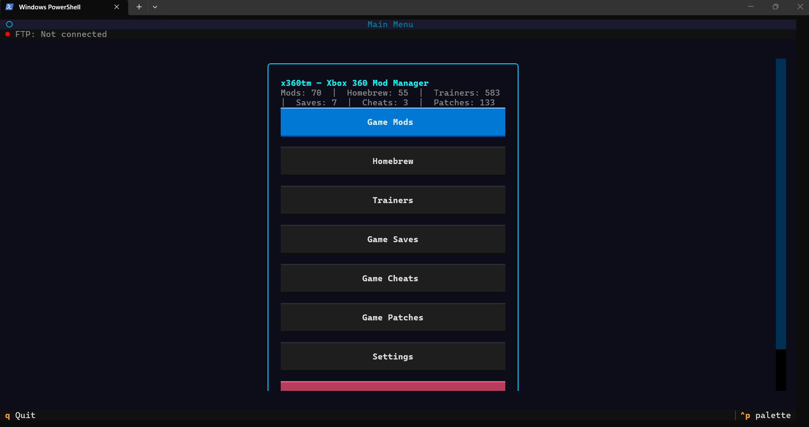
*The main menu shows your FTP connection status, live database counts (583 trainers, 70 mods, 55 homebrew, 133 patches, etc.), and quick-access buttons for every category. My Library is pinned at the top in green. The two orange buttons — Transfer Games and ISO → GOD — give you direct access to the local game management tools.*

---

### My Library — Game List
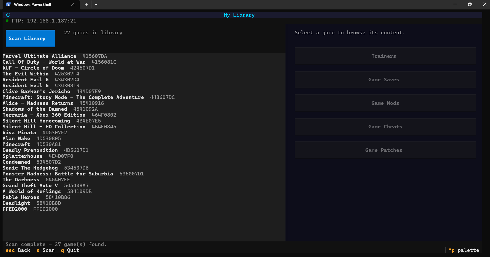
*After scanning your console via FTP, My Library lists all 27 detected games by name and Title ID. Select any game and use the right-hand panel to jump straight into its Trainers, Saves, Mods, Cheats, or Patches.*

---

### Trainers — Library Filter Active
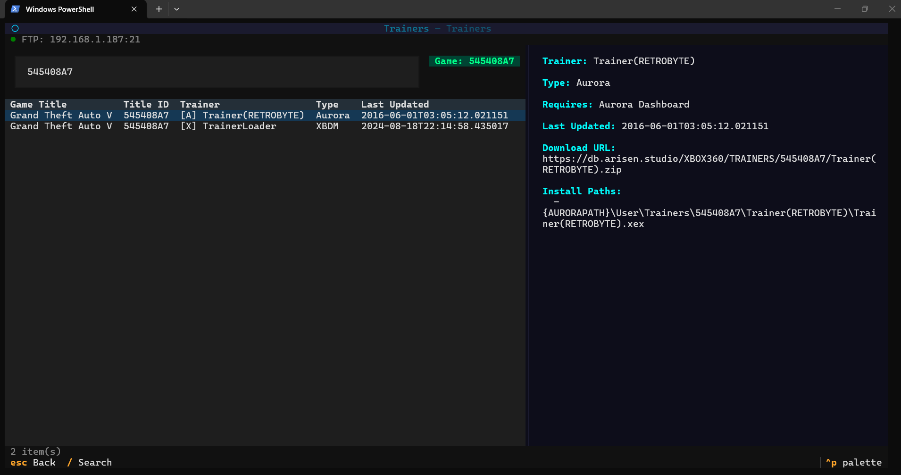
*Browsing trainers with the library filter applied — only trainers for your installed games are shown. Here GTA V (`545408A7`) has both an Aurora trainer and an XBDM TrainerLoader. The detail pane shows the full install path using `{AURORAPATH}` substitution.*

---

### Local Trainers — Library Filter + Local Source
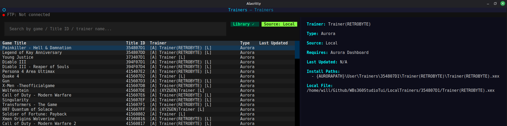
*Combining both filters: **Source: Local** restricts the list to trainers sourced from the `LocalTrainers/` repo folder, while **Library ✓** narrows results to only games present in your scanned library. Each row shows the `[A]` (Aurora) tag and `[L]` (local file) suffix. The detail pane confirms `Source: Local`, the Aurora install path, and the full path to the local `.xex` file on disk.*

---

### All Trainers
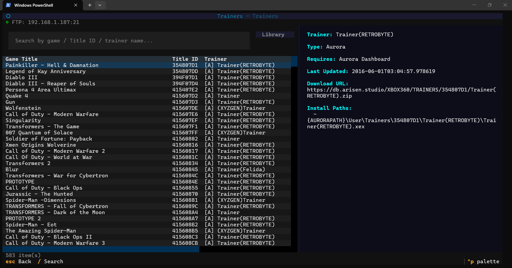
*The full trainers browser — 583 trainers across hundreds of games. Search by game name, Title ID, or trainer name. The `[A]` prefix indicates Aurora-compatible trainers; `[X]` indicates XBDM. The Library button in the top-right toggles the library filter.*

---

### Game Mods
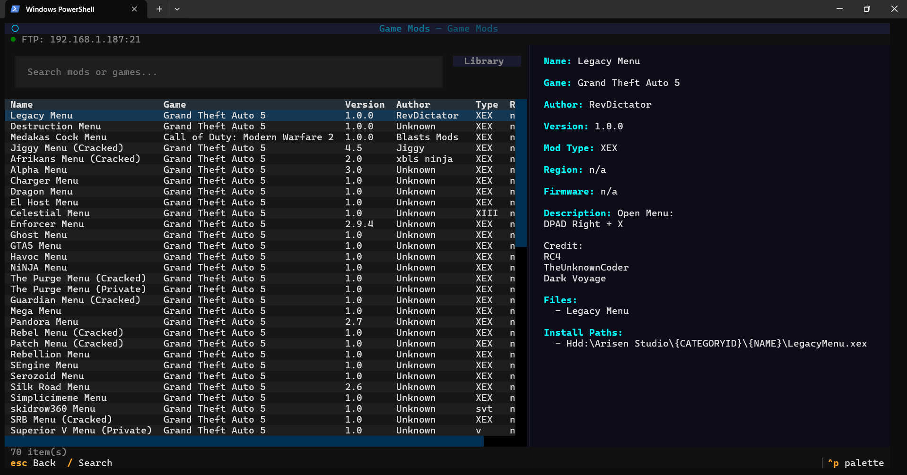
*70 game mods browsable with name, game, version, author, mod type, and region. The detail pane shows description, credits, files list, and the install path. Library filter available.*

---

### Homebrew
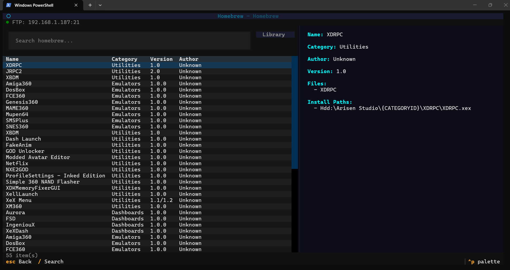
*55 homebrew apps across categories: Utilities (XDRPC, JRPC2, XBDM, FakeAnim, GOD Unlocker…), Dashboards (Aurora, FSD, XeXDash…), and Emulators (Amiga360, DosBox, SNES360, Mupen64…). Each entry shows its install path.*

---

### Game Saves
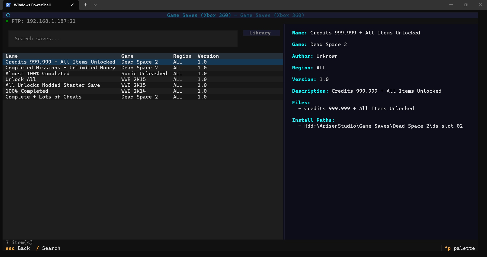
*Pre-made save files for Xbox 360 games — max money, 100% completion, all items unlocked. Region and version shown. Installs directly to your console's save folder via FTP.*

---

### Game Cheats
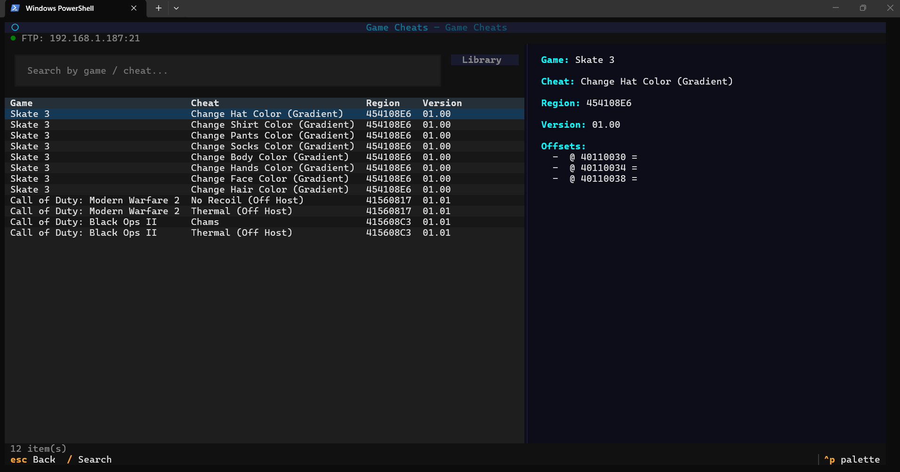
*Memory offset cheats for supported games. Shows game, cheat name, region, version, and raw memory offsets. Useful for JTAG/RGH users who apply cheats via memory patching tools.*

---

### Game Patches
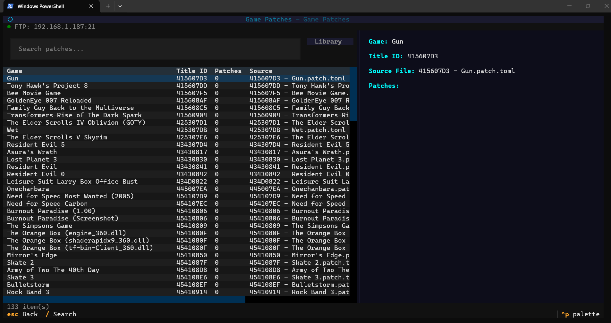
*133 title update patches across games including Skyrim, Resident Evil series, GTA V, Mirror's Edge, and more. Source `.patch.toml` files listed with Title ID for accurate matching.*

---

### Transfer Games
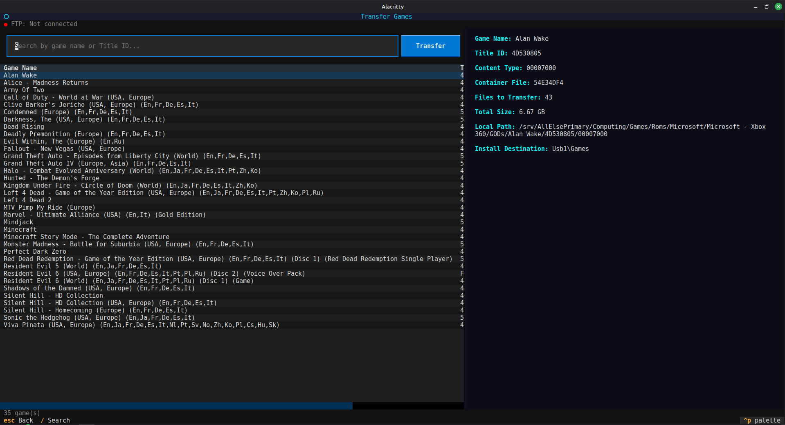
*The Transfer Games screen lists all locally-stored GOD format games found in your configured GOD path — 35 games shown here. Selecting Alan Wake reveals its Title ID (`4D530805`), content type folder (`00007000`), container file, the number of files to transfer (43), total size (6.67 GB), local path, and the install destination on the console. Hit Transfer (or `I`) to push the game over FTP or to a mounted USB drive.*

---

### ISO → GOD Converter
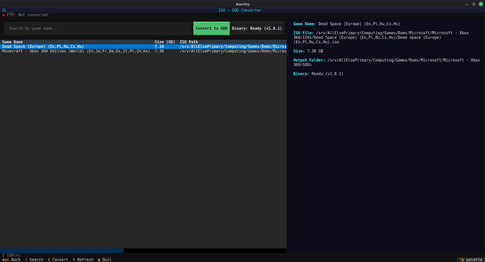
*The ISO → GOD converter scans your local ISO folder and lists all Xbox 360 disc images. Here Dead Space (Europe) and Minecraft are detected at 7.30 GB each. The detail pane shows the full ISO path, the output GOD folder, and the binary status (`Ready (v1.8.1)`). The `iso2god` binary (v1.8.1, powered by [iso2god-rs](https://github.com/iliazeus/iso2god-rs)) is downloaded automatically on first use — just click "Get Binary". Hit Convert to GOD (or `C`) to start the conversion with a live progress bar.*

---

### Settings — Top (Connection & Cache)
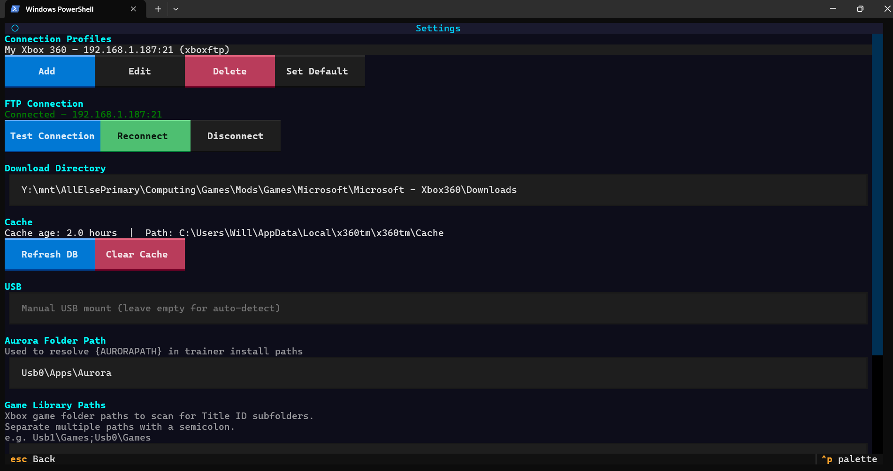
*Settings page showing the connection profile (`My Xbox 360 — 192.168.1.187:21`), live FTP status (Connected — green), Test Connection / Reconnect / Disconnect buttons, download directory, cache age, and Aurora folder path configuration.*

---

### Settings — Bottom (Library Paths & Save)
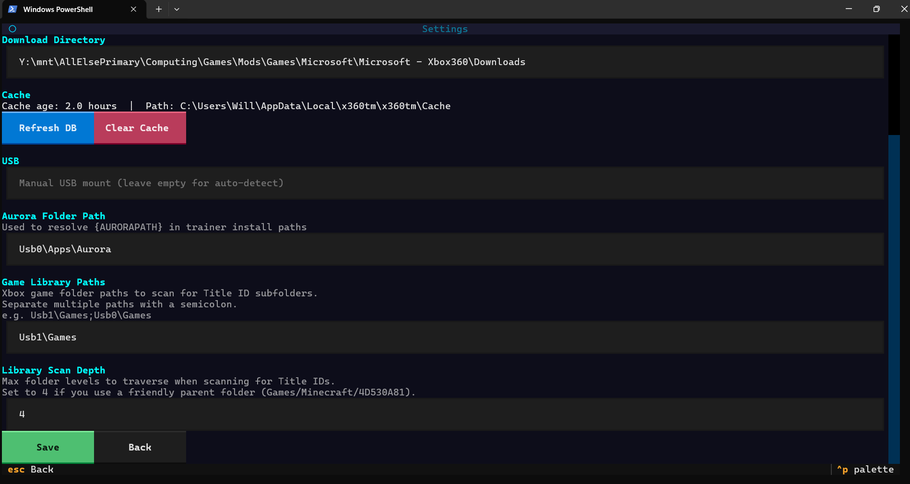
*Lower settings: game library paths (`Usb1\Games`), scan depth (4), and the Save button. All settings persist to JSON in the user config directory.*

---

## �🚀 What is x360tm?

x360tm is a full-featured terminal UI for Xbox 360 modding. Instead of hunting through websites or manually FTP-ing files, you get a fast, searchable, keyboard-driven interface that connects directly to your console and installs everything for you.

It pulls live data from the Arisen Studio public database — thousands of mods, trainers, game saves, cheats, and patches — all browsable and installable in seconds.

---

## ✨ Features

### 📚 Content Browser
- **Game Mods** — browse and install gameplay modifications
- **Homebrew** — custom apps and tools for your console
- **Trainers** — Aurora-compatible and XBDM cheat trainers
- **Game Saves** — pre-made saves (Xbox 360 only, PS3/PS4 filtered out)
- **Game Cheats** — memory offsets and cheat codes
- **Game Patches** — title update patches with full patch entry details
- Real-time **debounced search** across all categories
- Two-pane layout: **list + detail panel** side by side

### 🎮 My Library
- Configure your **Xbox game folder paths** (e.g. `Usb1\Games`) and a **scan depth**
- Scans your console via FTP and auto-discovers all installed Title ID folders
- **3,079 game titles** resolved from a bundled CSV — no internet lookup needed for names
- Select any game and instantly browse its **Trainers, Saves, Mods, Cheats, or Patches**
- Library filter toggle (`L`) in every browser screen — shows only content for your installed games

### 📡 FTP Install
- Direct install to your Xbox 360 over the network
- Full **Xbox drive prefix mapping**: `Hdd:` → `/Hdd1/`, `Usb0:` → `/Usb0/`, `Usb1:` → `/Usb1/`, etc.
- Automatic **directory creation** (MKD, Aurora FTP compatible — no MLST/MLSD)
- `{AURORAPATH}` placeholder substituted with your configured Aurora folder path
- Live progress bar during transfer
- Configurable **Aurora folder path** (e.g. `Usb0:\Apps\Aurora\`)

### 💾 USB Install
- Install directly to a connected USB drive
- Auto-detect or manually specify USB mount path
- Drive prefix stripped automatically

### 🎮 Transfer Games
- Browse locally-stored **GOD (Games on Demand)** format games from a configured local folder
- View per-game details: Title ID, content type, container file, file count, and total size
- Transfer to your Xbox 360 via **FTP** or directly to a **mounted USB drive**
- Searches by game name or Title ID
- Install destination configurable (default: `Hdd:\Content\0000000000000000\`)

### 💿 ISO → GOD Converter
- Scan a local folder for Xbox 360 **ISO disc images** and list them with name and size
- Convert ISOs to **GOD format** using the [iso2god-rs](https://github.com/iliazeus/iso2god-rs) binary (v1.8.1)
- Binary is **downloaded automatically** on first use — no manual setup required
- Live progress bar showing current part, total parts, and detected Title ID / game name
- Output goes directly to your configured **Local GOD Path**, ready to transfer via Transfer Games

### � FTP File Browser
- Navigate your Xbox 360's entire filesystem directly from the TUI
- Full directory listing using Aurora-compatible `LIST` commands (no MLSD/MLST required)
- Rename and delete files or directories in-place
- Keyboard shortcuts: `Backspace` / `U` to go up, `R` to refresh, `N` to rename, `Del` to delete
- Useful for inspecting installed content, tidying up folders, or verifying installs

### 🔧 Utilities — Game Directory Tidy-up
- Accessible via the **Utilities** button on the main menu
- Scans your configured **game install path** over FTP and analyses the folder structure of every game
- Looks up friendly game names from the bundled **4,047-title CSV** (no internet needed)
- **Fuzzy-matches** folder names for games stored without a Title ID subfolder (e.g. after manual copies) using `difflib` with a 55% confidence threshold
- Detects the **current structure** of each game (bare TitleID, Name/TitleID, other) and classifies each entry as: `CSV` (exact match), `Fuzzy XX%` (fuzzy match), `Dir` (inferred from directory structure), or `Unknown` (skipped)
- Choose your preferred **target format** from four options:
  - `TitleID` — e.g. `545408A7/`
  - `Name/TitleID` *(default)* — e.g. `GTA V/545408A7/`
  - `Name - TitleID` — e.g. `GTA V - 545408A7/`
  - `TitleID - Name` — e.g. `545408A7 - GTA V/`
- **Preview table** shows every game's planned action before anything is changed
- Switch format at any time — the plan rebuilds instantly without re-scanning
- **Confirmation modal** summarises exactly how many folders will move, are already correct, or will be skipped
- Applies changes over FTP using `RNFR`/`RNTO` (rename) — no files are copied or deleted
- Cleans up empty parent folders after moves

### �📁 Local Content (Offline Sources)
Alongside the Arisen Studio online database, x360tm supports **local content folders** bundled directly in the repo. These are scanned at startup and merged seamlessly with the online data — no internet required for local items.

| Folder | Content | Naming convention |
|--------|---------|-------------------|
| `LocalTrainers/` | Aurora `.xex` trainers | `{TitleID}/{TrainerFile}.xex` |
| `LocalMods/` | Game mods | `{TitleID}/{filename}` |
| `LocalHomebrew/` | Homebrew apps | `{AppName}/{filename}` |
| `LocalGameSaves/` | Pre-made save files | `{TitleID}/{filename}` |

**The repo ships with 550+ trainers** in `LocalTrainers/` — one subfolder per Title ID, each containing an Aurora-compatible `.xex` trainer file (RETROBYTE format).

**Metadata**: Drop a `mod.json`, `meta.json`, or `info.json` file inside any content folder to provide name, author, version, and description. Without it, the folder/file name is used as a fallback.

**In the UI**: Local items are merged with online results in every browser. Trainers sourced from local files show a `[L]` suffix in the trainer list. The detail pane shows `Source: Local` and the full local file path instead of a download URL. Install works identically — the local file is pushed directly over FTP or USB.

**Install paths** used for local content:
- Trainers → `{AURORAPATH}\User\Trainers\{TitleID}\{TrainerStem}\{filename}`
- Mods → `Hdd:\JTAG\{TitleID}\`
- Game Saves → `Hdd:\Content\0000000000000000\{TitleID}\000B0000\`

> **Note on empty folders**: Git does not track empty directories. After cloning, `LocalMods/`, `LocalHomebrew/`, and `LocalGameSaves/` will not appear until files are added. The app handles missing folders gracefully — they are simply skipped. Drop your own files in and they'll be picked up on next launch.

### ⚙️ Settings
- **Connection Profiles** — add, edit, delete, set default FTP connections
- **FTP Test / Reconnect / Disconnect** — inline connection health check with live status
- **Aurora Folder Path** — configurable per-user
- **Game Library Paths** — semicolon-separated Xbox paths for library scanning
- **Library Scan Depth** — how many folder levels deep to search (default: 4)
- **Download Directory** — where files are saved locally
- **Local GOD Path** — folder containing your converted GOD games (used by Transfer Games)
- **Local ISO Path** — folder containing your Xbox 360 ISO files (used by ISO → GOD)
- **Game Install Path** — destination path on console for GOD game transfers (default: `Hdd:\Content\0000000000000000\`)
- **DB Cache** — refresh from Arisen servers or clear, with age display

### 🔧 Technical
- Fully **async** (asyncio + aioftp + httpx) — never blocks the UI
- Smart **caching** of all database JSONs via platformdirs
- Graceful **timeout handling** for unresponsive FTP servers (Aurora's FtpDll quirks handled)
- **26 automated tests** covering database, installer, downloader, and path logic
- Clean **TCSS styling** with dark theme

---
## 📦 Install 

```bash
git clone https://github.com/WB2024/WBs360StudioTui
cd WBs360StudioTui

python -m venv .venv

# Windows
.\.venv\Scripts\activate

# Linux / macOS
source .venv/bin/activate

pip install -r requirements.txt
```

---

## ▶️ Run

```bash
python main.py
```

---

## 🧪 Tests

```bash
pip install -r requirements-dev.txt
pytest
```

---

## 📦 Build Standalone Executable

```bash
pip install pyinstaller
pyinstaller --onefile --name x360tm main.py
```

---

## ⌨️ Keyboard Shortcuts

| Key | Action |
|-----|--------|
| `↑` `↓` | Navigate list |
| `/` | Focus search bar |
| `L` | Toggle library filter (show only your games) |
| `I` | Install selected item / Transfer GOD game (Transfer Games screen) |
| `D` | Download selected item |
| `C` | Convert selected ISO to GOD (ISO → GOD screen) |
| `R` | Refresh table |
| `S` | Scan library (My Library screen) |
| `A` | Analyse games directory (Game Tidy-up screen) |
| `U` / `Backspace` | Go up one directory (FTP File Browser) |
| `N` | Rename selected item (FTP File Browser) |
| `Del` | Delete selected item (FTP File Browser) |
| `Esc` | Go back |
| `Q` | Quit |

---

## 🗂️ File Locations

| Type | Path |
|------|------|
| Settings | `platformdirs.user_config_dir("x360tm")/settings.json` |
| Cache | `platformdirs.user_cache_dir("x360tm")/` |
| Library | `platformdirs.user_cache_dir("x360tm")/library.json` |
| Logs | `platformdirs.user_log_dir("x360tm")/x360tm.log` |
| Local Trainers | `LocalTrainers/` (repo root — 550+ trainers shipped) |
| Local Mods | `LocalMods/` (repo root — add your own) |
| Local Homebrew | `LocalHomebrew/` (repo root — add your own) |
| Local Saves | `LocalGameSaves/` (repo root — add your own) |

---

## 🔌 Xbox FTP Setup

1. Install **Aurora Dashboard** on your Xbox 360
2. Enable FTP in Aurora → Settings → FTP
3. Note your console's IP address
4. In x360tm → **Settings → Connection Profiles → Add**
5. Enter IP, port (default `21`), username/password (default `xbox`/`xbox`)
6. Hit **Test Connection** to verify
7. Set as default profile

### Aurora Folder Path

If Aurora is at `Usb0:\Apps\Aurora\`, set that in Settings → Aurora Folder Path.  
This ensures trainers install to the right location.

### Game Library Scan

In Settings, set **Game Library Paths** to your games folder (e.g. `Usb1\Games`) and **Scan Depth** to `4` if your structure is:
```
Usb1\Games\
  Minecraft\
    4D530A81\    ← Title ID folder Aurora uses
```

Then open **My Library → Scan Library** and all your installed games appear by name.

---

## 🗺️ Roadmap

### Near-term
- [ ] **Bulk install** — queue multiple items and install in one go
- [ ] **Install history** — log of what was installed, when, and where
- [x] **FTP file browser** — navigate your console's filesystem directly from the TUI
- [x] **Game Directory Tidy-up** — reorganise your games folder into a consistent structure over FTP
- [ ] **Library auto-scan on connect** — scan automatically when FTP connection is established

### Medium-term
- [ ] **Update checker** — detect when a newer version of a trainer or mod is available vs what's installed
- [ ] **Uninstall support** — remove installed mods/trainers via FTP
- [ ] **Custom categories / favourites** — bookmark items for quick access
- [ ] **Multiple console profiles** — quickly switch between different consoles

### Long-term / Ambitious
- [ ] **Plugin system** — allow community-contributed content sources beyond Arisen Studio
- [ ] **Save file manager** — browse, backup, and restore saves from your console directly
- [ ] **Trainer launcher** — trigger trainer activation via XBDM without leaving the TUI
- [ ] **Game cover art** — display box art thumbnails alongside game listings
- [ ] **Web UI mode** — serve x360tm as a lightweight local web app for phone/tablet access

---

## 📝 Notes

- **Xbox 360 only** — PS3/PS4 entries from Arisen Studio are filtered out automatically.
- **Aurora FTP compatibility** — the FTP client uses raw `LIST`/`MKD` commands, avoiding unsupported `MLST`/`MLSD`/`EPSV` that Aurora's FtpDll rejects.
- **Drive mapping**: Aurora exposes drives as root directories (`Hdd1`, `Usb0`, `Usb1`, `Game`). x360tm maps Xbox-style paths automatically.
- **`ConnectionResetError` on disconnect** is a cosmetic Windows asyncio quirk when Aurora closes the socket — it does not affect transfers.
- **Local content folders** (`LocalMods/`, `LocalHomebrew/`, `LocalGameSaves/`) are empty by default and will not appear after a fresh clone — Git does not track empty directories. This is expected. Add files to them and they'll be picked up automatically.

---

## 🤝 Contributing

PRs welcome. Run `pytest` before submitting. Please keep changes focused and include tests for new logic.

---

<div align="center">

### ☕ Enjoyed x360tm? Buy me a coffee!

<a href="https://buymeacoffee.com/succinctrecords">
  
</a>

**This project is free and open source.**  
If it saved you time, impressed your friends, or helped you finally get that trainer working —  
consider buying me a coffee. It genuinely makes a difference and keeps me building. ☕

👉 **[buymeacoffee.com/succinctrecords](https://buymeacoffee.com/succinctrecords)**

</div>
